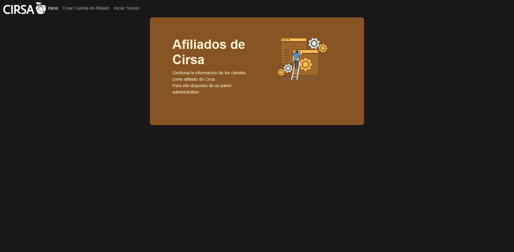
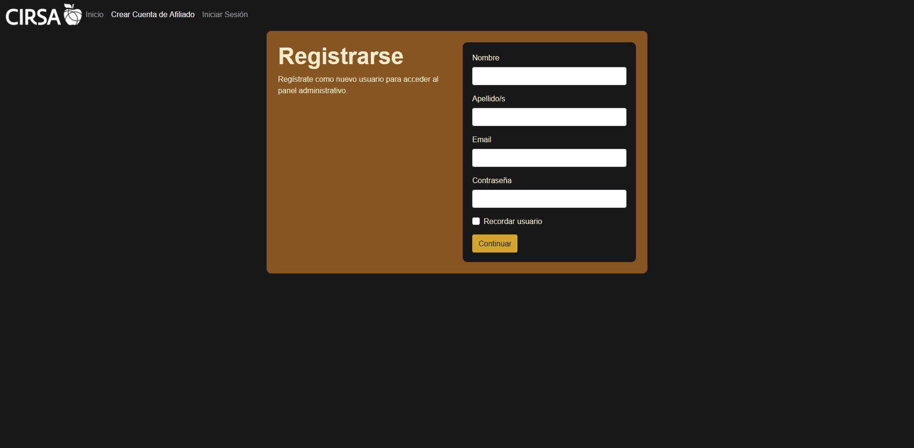
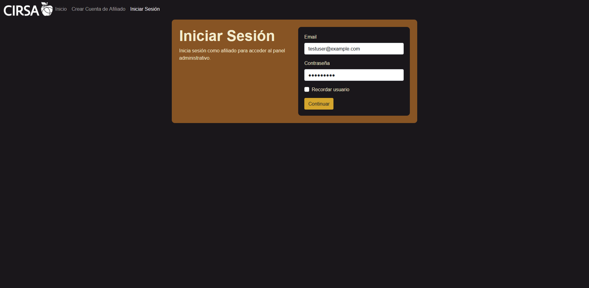
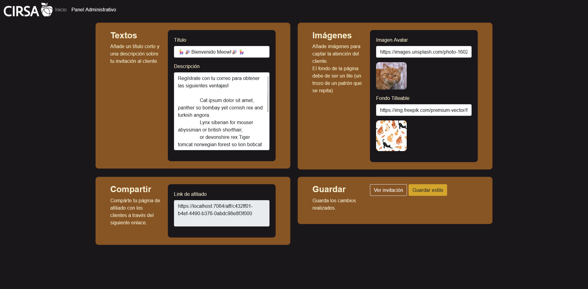
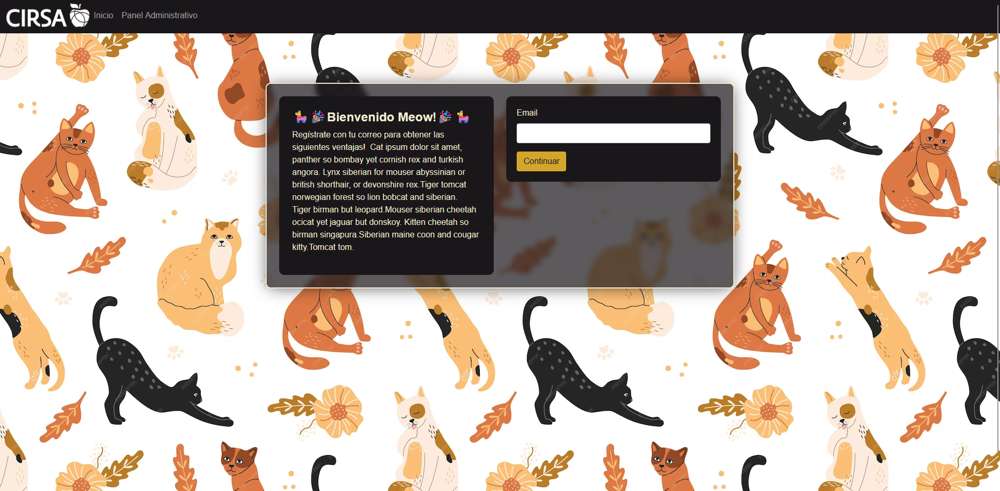

# CirsaHackaton

## 🌐 Website
https://miguelcanosantana.github.io/CirsaHackaton/

###### Data is not saved when reloading or closing the page as this is a local app.
There is a test user with some example data precharged:
- User: testuser@example.com
- Password: 123456789

## 📒 User Guide

This is the landing page. With a brief presentation of the web app. To navigate between pages use the top navbar.


You can register a profile clicking in `Crear Cuenta de Afiliado`. (Keep in mind there is no data saving, reloading the browser deletes user info).


You can login too clicking in `Iniciar Sesión`, it's recommended to use the fake profile in the top section of this readme.


When registering or loging succesfully, you will be redirected to the dashboard page, here you can manage the affiliate referral page appearance.

- `Textos` > `Título`: You can change the title of the invitation.
- `Textos` > `Description`: You can give a description about the referral advantages.
- `Imágenes` > `Imagen Avatar` (Not implemented): You can change the avatar image of the user in the invite.
- `Imágenes` > `Fondo Tilleable`: Use a tilleable pattern background to display in the message.
- `Compartir` > `Link de afiliado`: Share this link to share the referral invitation (Keep in mind it only works for the test profile as there is no data saving feature)
- `Guardar` > `Guardar estilo`: Saves the style.
- `Guardar` > `Ver invitación`: Previews the invitation (Use this button if you made changes and pressed `Guardar estilo` instead just copying the code.


Default customer invitation.


## 🚀 How to Deploy 
This turorial has been used to deploy the site to github pages. [Tutorial](https://ilovedotnet.org/blogs/blazor-wasm-publishing-to-github-pages/)

Using a custom Github Action, in this case would be the following:
```
name: github pages

# Run workflow on every push to the master branch
on:
  push:
    branches:
      - main
  pull_request:
    branches:
      - main

jobs:
  deploy-to-github-pages:
  # use ubuntu-latest image to run steps on
    runs-on: ubuntu-latest
    steps:
    # uses GitHub's checkout action to checkout code form the main branch
    - uses: actions/checkout@v2

    # sets up .NET Core SDK 6.0.x
    - name: Setup .NET Core SDK
      uses: actions/setup-dotnet@v3.2.0

    # Install dotnet wasm buildtools workload
    - name: Install .NET WASM Build Tools
      run: dotnet workload install wasm-tools

    # Publishes Blazor project to the release-folder
    - name: Publish .NET Core Project
      run: dotnet publish ./CirsaHack.csproj -c:Release -p:GHPages=true -o dist/Web --nologo

    - name: Commit wwwroot to GitHub Pages
      uses: JamesIves/github-pages-deploy-action@3.7.1
      with:
        GITHUB_TOKEN: ${{ secrets.GITHUB_TOKEN }}
        BRANCH: gh-pages
        FOLDER: dist/Web/wwwroot
```

🚦 Inside the Repo Settings > Actions > General in the Workflow permissions category, allow Read and Write permissions.

🗒️ This repo has 2 branches, the main one, and the gh-pages, created automatically by the action. 
The page content is only generated with those files in the second branch.
